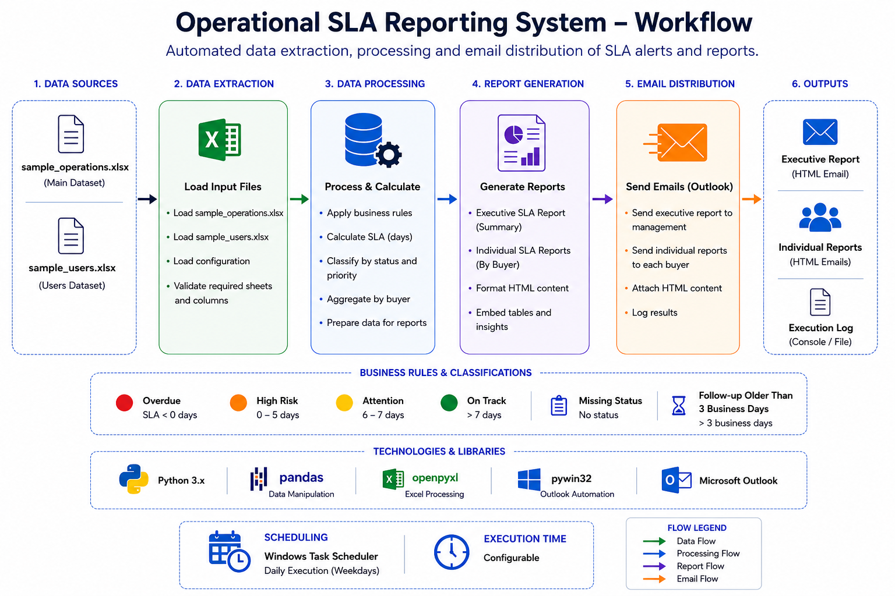

# 🚀 Operational SLA Reporting System

Python automation for monitoring operational activities and automatically delivering executive and individual SLA reports.

This project automates the complete SLA reporting workflow, from Excel data processing to HTML report generation and Outlook email distribution.

---

## 📌 Features

- Read operational Excel datasets
- Apply SLA business rules
- Classify operational requests by priority
- Calculate SLA deadlines automatically
- Generate Executive SLA Reports
- Generate Individual SLA Reports by buyer
- Produce HTML-formatted reports
- Automatically send reports via Microsoft Outlook
- Generate execution logs
---

## 🔄 Workflow



---

## 📁 Project Structure

```text
Operational-SLA-Reporting-System/
│
├── data/
│   ├── sample_operations.xlsx
│   └── sample_users.xlsx
│
├── images/
│   ├── workflow_overview.png
│   ├── management-report-example.png
│   └── individual-sla-report-example.png
│
├── src/
│   ├── executive_sla_report.py
│   └── individual_sla_report.py
│
├── requirements.txt
├── README.md
└── LICENSE
```

---

## ⚙️ Technologies

- Python 3.x
- pandas
- openpyxl
- pywin32
- Microsoft Outlook
- HTML

---

## 📦 Installation

```bash
pip install -r requirements.txt
```

---

## ▶️ Usage

Run the main automation script:

```bash
python src/executive_sla_report.py
```

or

```bash
python src/individual_sla_report.py
```

---

## 📊 Sample Datasets

This repository includes fictional datasets for demonstration purposes.

- `sample_operations.xlsx`
- `sample_users.xlsx`

---

## 📄 License

MIT License.

---

## 👨‍💻 Author

**Eduardo Maia**

LinkedIn:[https://www.linkedin.com/in/eduardomaia1

GitHub:
https://github.com/Dummaia
