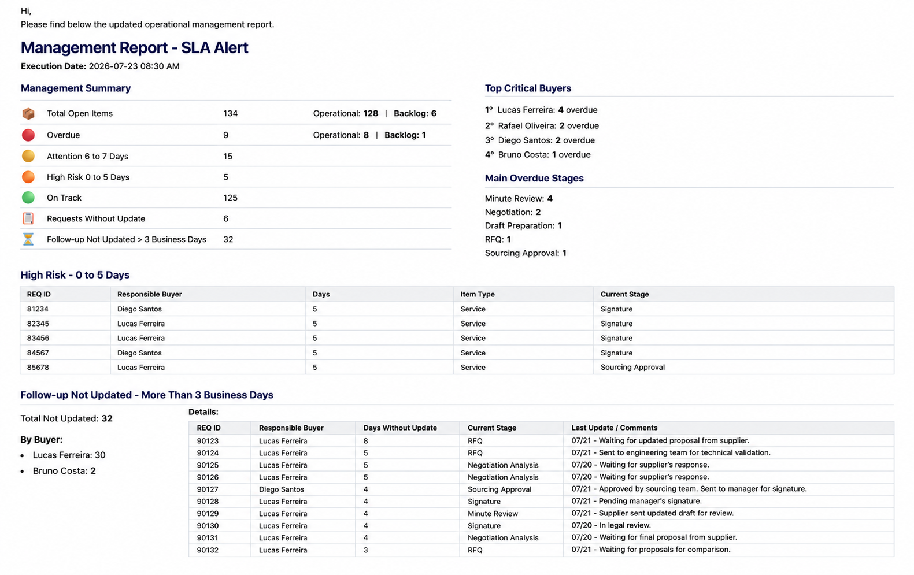
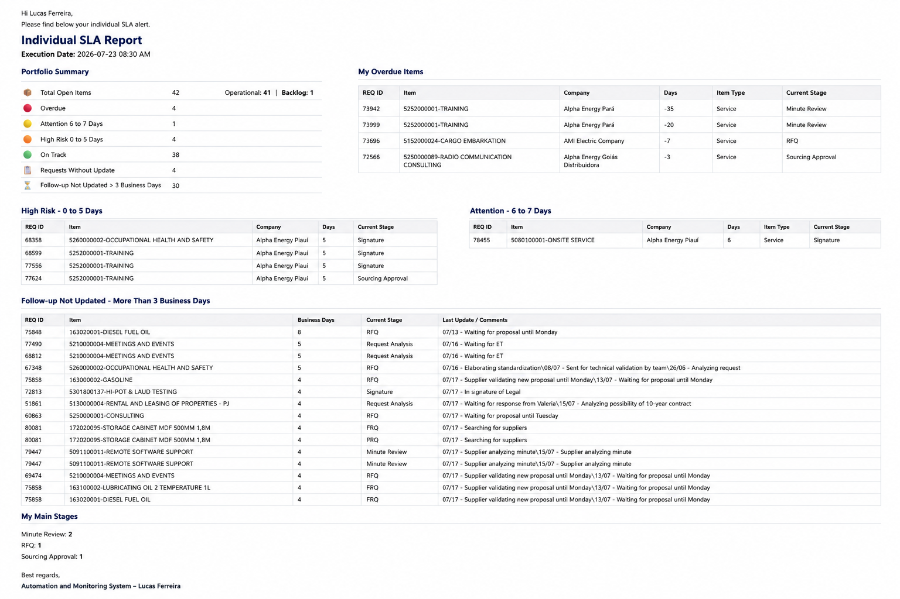

# 🚀 Operational SLA Reporting System

An automation project developed in Python for monitoring operational activities, applying SLA business rules, and automatically generating executive and individual HTML reports delivered via Microsoft Outlook.

This project demonstrates how operational Excel data can be transformed into actionable management information through automated processing and report generation.

---

# 📌 Features

- Read operational Excel datasets
- Apply SLA business rules
- Classify operational requests by priority
- Calculate SLA deadlines automatically
- Generate Executive SLA Reports
- Generate Individual SLA Reports by buyer
- Produce HTML formatted reports
- Automatically send reports via Microsoft Outlook
- Generate execution logs

---

# 🔄 Workflow


---

# 📊 Executive Report Example

The Executive Report provides a consolidated management view of the operational portfolio, highlighting SLA risks, critical buyers and operational indicators.



---

# 👤 Individual Report Example

Each buyer automatically receives a personalized report containing only their own operational portfolio, overdue requests, upcoming deadlines and follow-up status.



---

# 📁 Project Structure

```text
Operational-SLA-Reporting-System
│
├── data/
│   ├── sample_operations.xlsx
│   └── sample_users.xlsx
│
├── images/
│   ├── workflow_overview.png
│   ├── management-report-example.png
│   └── individual-sla-report-example.png
│
├── src/
│   ├── executive_sla_report.py
│   └── individual_sla_report.py
│
├── README.md
├── requirements.txt
├── LICENSE
└── .gitignore
```

---

# ⚙️ Technologies

- Python 3.x
- Pandas
- OpenPyXL
- pywin32
- Microsoft Outlook
- HTML

---

# 📦 Installation

Clone the repository.

```bash
git clone https://github.com/Dummaia/Operational-SLA-Reporting-System.git
```

Navigate to the project directory.

```bash
cd Operational-SLA-Reporting-System
```

Install the required libraries.

```bash
pip install -r requirements.txt
```

---

# ▶️ Running the Project

Generate the executive report:

```bash
python src/executive_sla_report.py
```

Generate the individual reports:

```bash
python src/individual_sla_report.py
```

---

# 📄 Sample Datasets

The repository contains sample datasets for demonstration purposes.

- sample_operations.xlsx
- sample_users.xlsx

No confidential business information is included.

---

# 🔒 License

This project is licensed under the MIT License.

See the LICENSE file for details.

---

# 👨‍💻 Author

**Eduardo Maia**

Data Analyst | Python Automation | Business Intelligence | Process Automation

GitHub:
https://github.com/Dummaia
